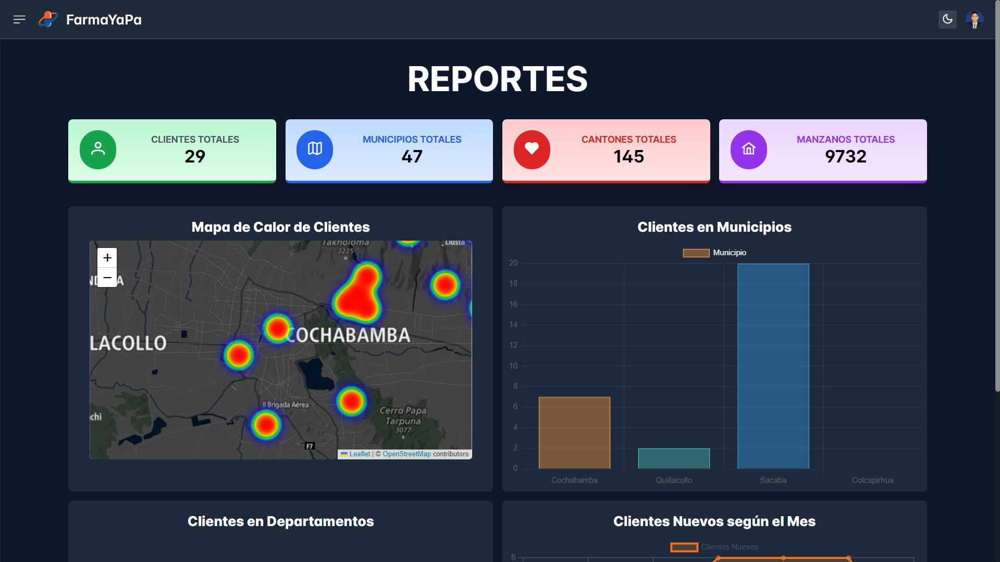
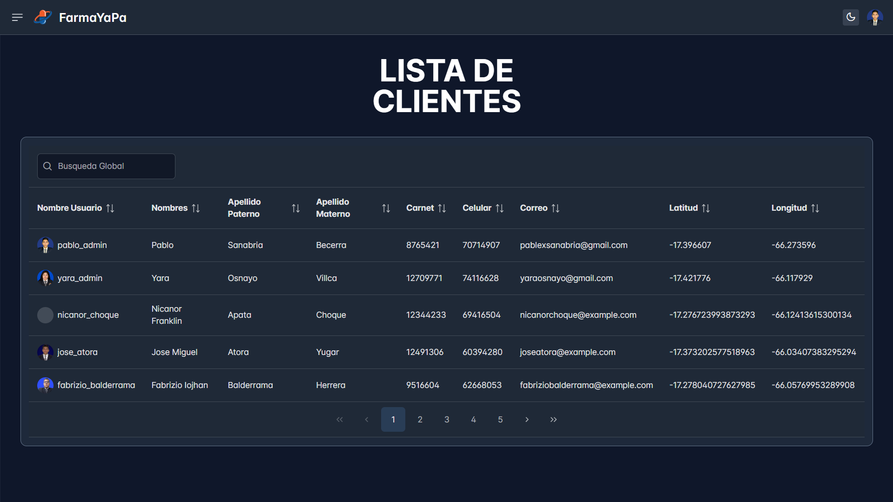
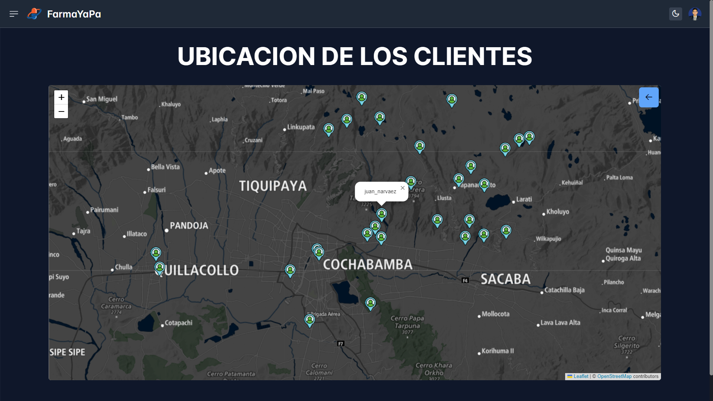
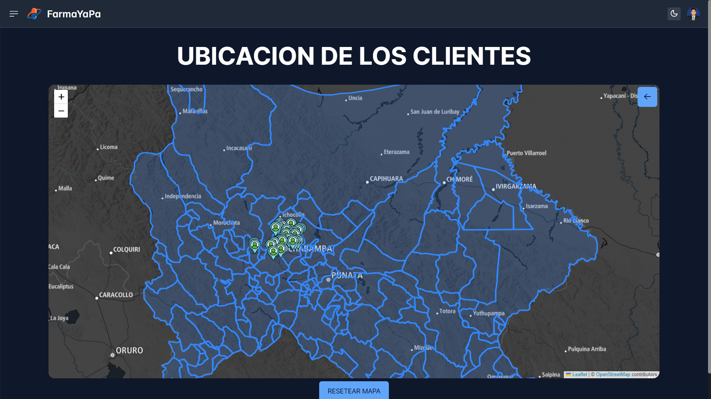

# Sistema-Geoespacial-PERN

    

    
    
    
    
    
    

## Descripción
Sistema web basado en la administración de una farmacia, con un enfoque de análisis de mercado, para la toma de decisiones. Principalmente se enfoca en el registro de ubicación de los usuarios y el análisis de datos con esta información.

Se utilizó ReactJS para el desarrollo de las interfaces y Node.js para la lógica del servidor, con el framework ExpressJS. Adicionalmente se implementó una base de datos Geoespacial utilizando la base de datos Postgres con la extensión PostGIS.

## Características
- Página para la toma de decisiones de una farmacia.
- API desarrollada en NodeJS, utilizando JWT.
- Inicio de sesión, registro, actualización, dashboard y reportes.

## Instrucciones de Uso

### Frontend (React)
1. Abra la terminal y navegue a la carpeta del Frontend: `cd Frontend`.
2. Instale las dependencias utilizando el comando: `npm install`.

### Backend (Express)
1. Abra otra terminal y navegue a la carpeta del Backend: `cd Backend`.
2. Instale las dependencias necesarias ejecutando: `npm install`.

### Ejecución
1. En la terminal del Frontend, ejecute el proyecto React con el comando: `npm run dev`.
2. En la terminal del Backend, inicie el servidor ExpressJS con: `npm run dev`.

## Dependencias
Las dependencias están en el mismo repositorio.

## Imágenes

    
    

    
    

## Licencia
Este proyecto está bajo la Licencia MIT. Consulta el archivo [LICENSE](LICENSE) para obtener más detalles.
