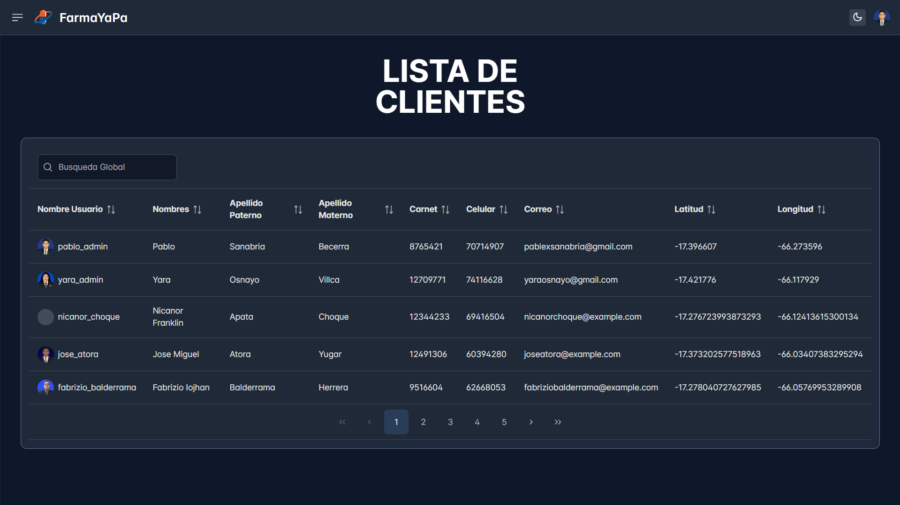

# Sistema-Geoespacial-PERN

    

## Descripción
Sistema web basado en la administracion de una farmacia, con un enfoque de analisis de mercado, para la toma de desiciones. Principalmente se enfoca en el registro de ubicacion de los usuarios y el analisis de datos con esta informacion.

Se utilizo ReactJS para el desarrollo de las interfaces y Node js para la logica del servidor, con el framework ExpressJS. Adicionalmente se implemento una base de datos Geoespacial utilizando la base de datos Postgres con las extension postgis.

## Características
- Pagina para la Toma de desiciones de una farmacia.
- API desarrollada en NodeJS, utilizando JWT.
- Inicio de sesion, registro, actualizacion, dashboard y reportes.

## Instrucciones de Uso
### Frontend (React)

1. Abra la terminal y navegue a la carpeta del Frontend: `cd Frontend`.
2. Instale las dependencias utilizando el comando: `npm install`.

### Backend (Flask)

1. Abra otra terminal y navegue a la carpeta del Backend: `cd Backend`.
2. Instale las librerías necesarias ejecutando: `npm run dev`.

### Ejecución

1. En la terminal del Frontend, ejecute el proyecto React con el comando: `npm run dev`.
2. En la terminal del Backend, inicie el servidor ExpressJS con: `npm run dev`.

## Dependencias
Las dependecias estan en el mismo repositorio.

## Imagenes

    
    

    
    

## Licencia
Este proyecto está bajo la Licencia MIT. Consulta el archivo [LICENSE](LICENSE) para obtener más detalles.

---

